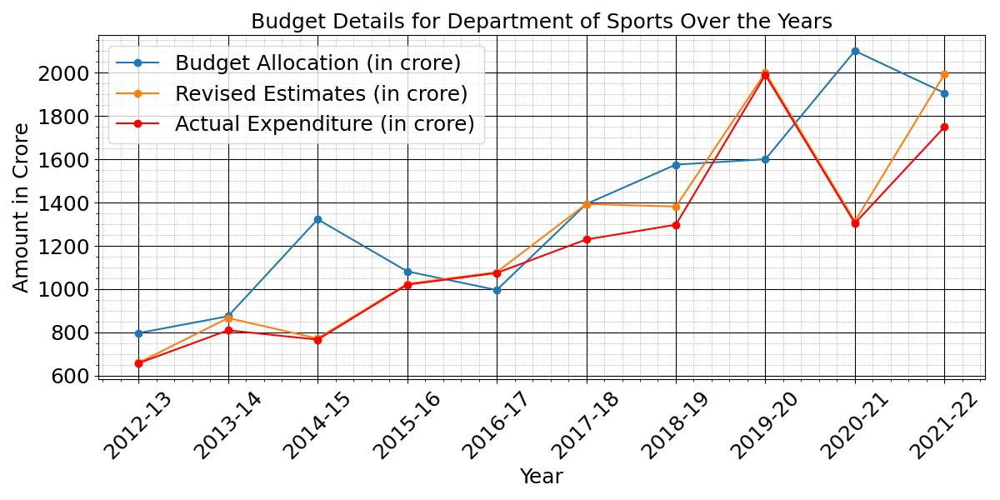
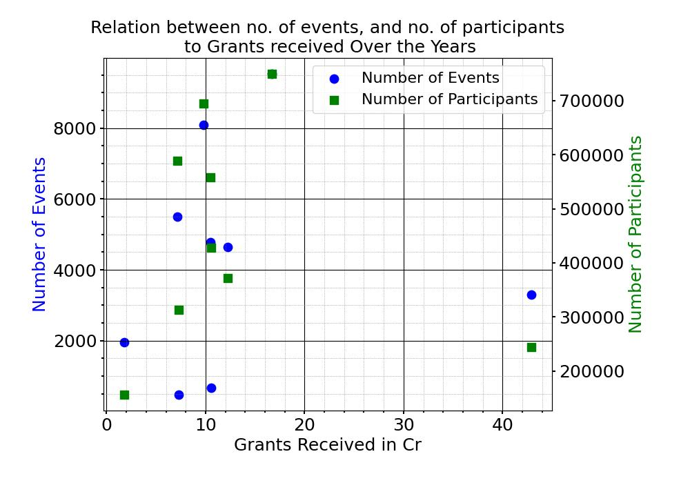
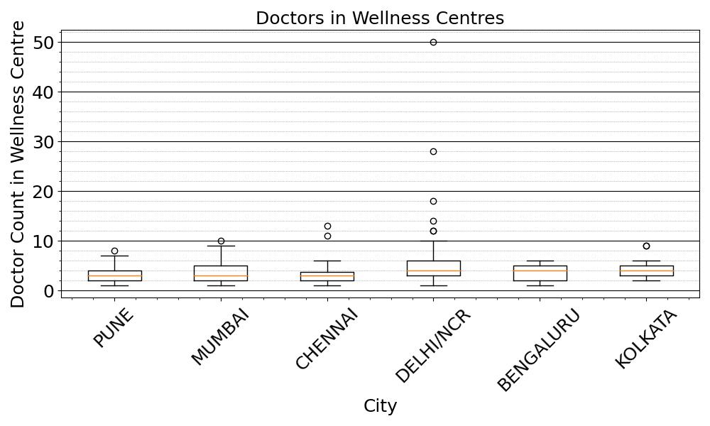

The data is obtained from the [Open Government Data Platform ](https://data.gov.in/).
The analysis is done on the 3 Datasets: Year-wise Budget Allocation for the Department of Sports from 2012-13 to 2021-22, the Neighbourhood Youth Parliament Component under NYLP from 2014 to 2023, and the City-wise list of Wellness Centres.

Below are the visualizations of the same.

  

We see that there has been an increase in the budget allocated for Dept of sports, except for the year of COVID. The revised estimates have been on par with the actual expenditure.

  

We see that there is no relation between the grants received the number of events organized and the number of participants.

  

Most wellness centers across cities have doctors in single digits and only a few outliers have over 10 doctors.

